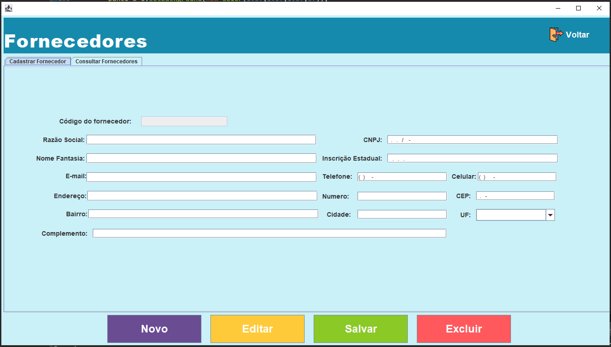
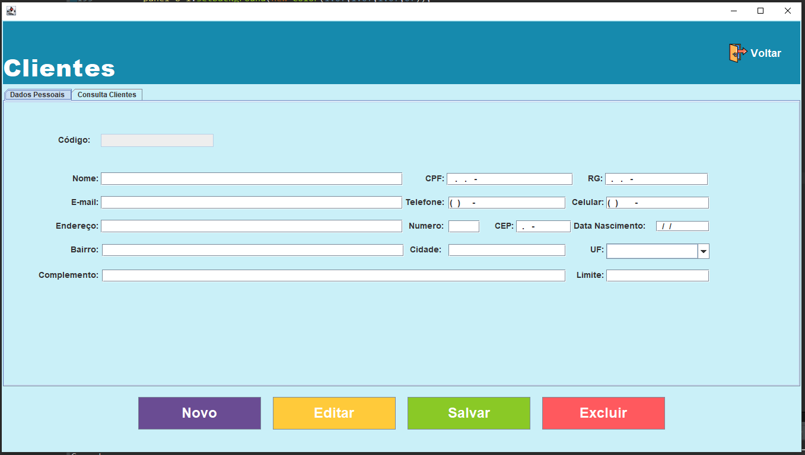

# SistemaMercearia
 Project Creating for PI Fatec - Interdisciplinary Project Integrator
 
 ## Tela de Login
 Tela responsável por realizar a autenticação do usuário tratando também o nível de acesso de cada funcionário.
 

    
 

 ## Tela  Menu Principal - Caixa
Tela responsável pela navegabilidade das atribuições do funcionário(a) Caixa.
Onde mostra quais são os acessos permitido para o mesmo(a). Neste caso o(a)
Caixa é responsável apenas por efetuar a venda dos produtos e consultar as vendas efetuadas.
   

    
 

  ## Tela Menu Principal - Estoquista
   Tela responsável pela navegabilidade das atribuições do(a) funcionário(a) 
   Estoquista. Onde mostra quais são os acessos permitido para o(a) mesmo(a).
   Neste caso o(a) Estoquista é responsável por manter o cadastro de Fornecedores, Produtos, Estoque, Categorias e Subcategorias com quaisquer alteração podendo também efetuar sua exclusão ou atualização.
 

    
 

  ## Tela Menu Principal - Gerente
   Tela responsável pela navegabilidade das atribuições do(a) Gerente 
   Estoquista. Onde mostra quais são os acessos permitido para o(a) mesmo(a).
   Neste caso o(a) Gerente é tem acesso ao cadastro de Fornecedores, Produtos, Estoque, Categorias e Subcategorias com quaisquer alteração podendo também efetuar sua exclusão ou atualização. Também tem acesso para efetuar a venda dos produtos e consultar as vendas efetuadas, além de ter acesso para cadastro de novos Cliente e Funcionários onde faz o gerenciamento de acessos e de senha podendo resetá-las quando necessárias. 
 

    
 

  ## Tela Cadastro de Produtos 
  Tela responsável por realizar a inserção, atualização, exclusão de novos produtos na base de dados,
  contando também com a informação da data de inserção e de fornecedor.
  Onde na Base de dados conta com Triggers que efetuam a persistência no banco de dados, sem a necessidade do tratamento por parte do programa.
 

    
 

 
  ## Tela Consulta de Produtos
  Tela responsável por realizar a consulta de todos os produtos cadastrados
 

    
 

  ## Tela Cadastro de Categorias 
  Tela responsável por realizar a inserção, atualização, exclusão de novas categorias na base de dados.
 

    
 

 
  ## Tela Consulta de Categorias
  Tela responsável por realizar a consulta de todas as categorias cadastradas
 

    
 

  ## Tela Cadastro de SubCategorias 
  Tela responsável por realizar a inserção, atualização, exclusão de novas subcategorias na base de dados.
 

    
 

 
  ## Tela Consulta de SubCategorias
  Tela responsável por realizar a consulta de todas as subcategorias cadastradas
 

    
 

## Tela Cadastro de Fornecedores
  Tela responsável por realizar a inserção, atualização, exclusão de novos fornecedores na base de dados, para que possa ser mantido um histórico juntamente com produtos para conhecermos e saber de quem compramos quanto pagamos e a quantidade compradas. 
 

    
 

 
  ## Tela Consulta de Fornecedores
  Tela responsável por realizar a consulta de todos os fornecedores que temos  cadastrados
 

    
 

 ## Tela Cadastro de Clientes
  Tela responsável por realizar a inserção, atualização, exclusão de novos clientes na base de dados, para que possa ser mantido um histórico e futuramente oferecer descontos exclusivos personalizados alem de uma possível venda a prazo. 
 

    
 

 
  ## Tela Consulta de Clientes
  Tela responsável por realizar a consulta de todos os clientes que temos  cadastrados
 

    
 

  ## Tela Cadastro de Funcionários
  Tela responsável por realizar a inserção, atualização, exclusão, inativação de novos funcionários na base de dados, para que possa ser mantido um histórico de todos os funcionários que já prestaram serviço ao estabelecimento. 
 

    
 

 
  ## Tela Consulta de Funcionários
  Tela responsável por realizar a consulta de todos os funcionários que temos  cadastrados
 

    
 

   ## Tela Cadastro de Estoque
  Tela responsável por realizar a inserção de produtos no estoque informando de qual fornecedor efetuamos a compra a fim de manter um histórico de todas as compras efetuadas e os fornecedores de quem compramos.
 

    
 

 
  ## Tela Consulta de Estoque
  Tela responsável por realizar a consulta de todos os produtos que temos  cadastrados e de quem compramos.
 

    
 

   ## Tela Frente de Caixa
  Tela responsável por realizar a efetivação de vendas aos nossos clientes finais,
  além de efetuar a abertura de caixa podendo assim termos um controle ainda melhor do que vendemos no dia, mantendo um histórico de quem efetuou a venda, troco inicial de abertura do caixa, e fechamento do caixa. E um 
  sistema de consulta de fácil acesso e rápido. 

  #### Pontos não implementados ainda
  *Nota Paulista e Emissão de Cupom Fiscal - ainda não foram completamente implementadas podendo assim vir numa nova versão do software. 
 

    
 

  ## Tela Forma de Pagamento
  Tela responsável por realizar a efetivação e cadastro das forma de pagamento utilizadas naquela venda, além do cálculo do troco quando necessário para otimizar o processo de venda.
 

    
 

  ## Tela Consulta de Vendas
  Tela responsável por realizar a consulta das vendas efetuadas no periodo.
  
  #### Pontos não implementados ainda
  *A consulta por data ainda está inativa
 

    
 

   ## Tela Consulta de Vendas
  Tela responsável por realizar a consulta dos itens ofertados na venda em questão onde ao clicar na tela anterior de consulta de vendas ela preenche automaticamente para conferirmos com mais detalhes importantes sobre a venda efetuada .
  
 

    
 
